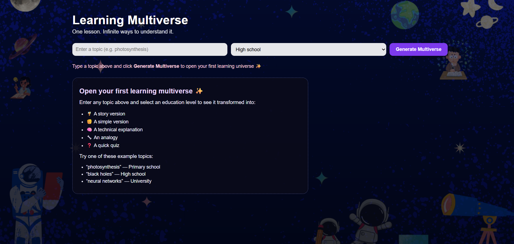
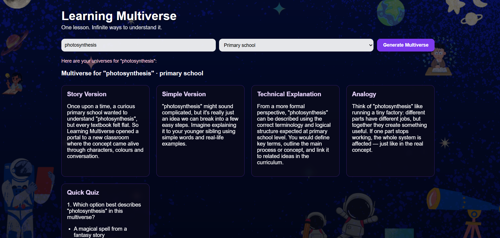
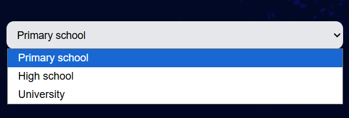
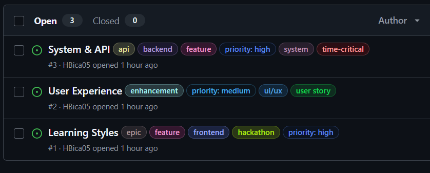
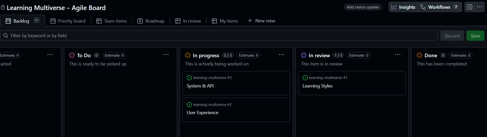

# 🌌 Learning Multiverse
One lesson. Infinite ways to understand it.

# 📘 Table of Contents

- [🌌 Learning Multiverse](#-learning-multiverse)
- [📘 Table of Contents](#-table-of-contents)
- [⭐ Overview](#-overview)
- [🎓 Educational Impact -- Why Learning Multiverse works?](#-educational-impact----why-learning-multiverse-works)
- [🎨 Features](#-features)
  - [🌈 AI-Powered Multi-Style Learning](#-ai-powered-multi-style-learning)
- [🧠 Age-Appropriate Levels](#-age-appropriate-levels)
- [🛸 Beautiful Cosmic UI Theme](#-beautiful-cosmic-ui-theme)
- [🌀 Agile Methodology](#-agile-methodology)
- [🗂️ Project Board (Kanban)](#️-project-board-kanban)
- [🧩 User Stories](#-user-stories)
  - [User Story 1 — Learning Styles](#user-story-1--learning-styles)
  - [User Story 2 — User Interface](#user-story-2--user-interface)
  - [User Story 3 — System \& API](#user-story-3--system--api)
- [🏷️ Issue Labels](#️-issue-labels)
- [🛠️ Tech Stack](#️-tech-stack)
  - [Frontend](#frontend)
  - [Backend](#backend)
- [🧪 Testing](#-testing)
  - [✔ Browser Testing](#-browser-testing)
  - [✔ Functional Testing](#-functional-testing)
- [⚙️ Installation \& Setup (Local)](#️-installation--setup-local)
- [🌐 Deployment](#-deployment)
- [🧭 File Structure](#-file-structure)
- [🔮 Future Features](#-future-features)
- [❤️ Credits](#️-credits)
- [🏁 Conclusion](#-conclusion)

# ⭐ Overview

Learning Multiverse is an AI-powered educational tool that transforms any topic into multiple learning styles, helping learners of different ages, backgrounds, and abilities understand complex ideas through personalized explanations.

Enter any topic — “photosynthesis”, “gravity”, “democracy”, “jacket” — and Learning Multiverse instantly generates:

🧚 Story Version

🧒 Simple Version

🧠 Technical Explanation

🔧 Analogy Explanation

❓ Quiz Questions

The goal is to empower learners by offering multiple pathways to comprehension, inspired by real pedagogy techniques and UDL (Universal Design for Learning).

🚀 Live Demo / Preview

👉 If deployed on Render/Vercel, place link here
👉 http://localhost:3000 during development

# 🎓 Educational Impact -- Why Learning Multiverse works?
Learning Multiverse supports diverse learning needs by offering multiple representations of the same topic. Some students learn best through stories, others through analogy or technical explanation. The quiz reinforces understanding. This aligns with the Universal Design for Learning (UDL) framework and helps learners of different ages and backgrounds engage more effectively.
 ♿ Accessibility

Learning Multiverse includes several accessibility-focused design choices to ensure the app is usable for learners of all abilities:

✔ High Contrast & Readability

A gradient overlay is used on the cosmic background to keep all text clear and easy to read.

✔ Keyboard Navigation

All inputs and buttons support keyboard navigation, with visible focus indicators for accessibility.

✔ Screen Reader Support

The status message uses aria-live="polite" so screen readers announce updates while content is generating.

✔ Responsive Design

The layout adapts to mobile, tablet, and desktop screens, ensuring easy access from any device.

✔ Multiple Ways to Learn

Providing story, simple, technical, and analogy explanations supports diverse learning needs, including ESL learners and neurodivergent users.

# 🎨 Features
## 🌈 AI-Powered Multi-Style Learning

Generates 4 learning style explanations + a quiz for any topic.

# 🧠 Age-Appropriate Levels

Choose between:

Primary School

High School

University / Adult

# 🛸 Beautiful Cosmic UI Theme

The interface sits on top of a custom Canva-designed celestial background with soft gradients and glass-card elements.

⚡ Fast & Responsive

Runs on lightweight Node.js backend, serves instantly.

📱 Mobile Friendly

Responsive layout with grid-based cards and fluid spacing.

🖼️ Screenshots
🌌 Home Interface

✨ Generated Multiverse Output

# 🌀 Agile Methodology

This project was built using Agile principles to ensure rapid iteration, clarity of workflow, and continuous improvement.

# 🗂️ Project Board (Kanban)

A GitHub Project (Kanban board) was created with four columns:

Backlog – ideas and future work

To Do – issues planned for current sprint

In Progress – actively being worked on

Done – completed and reviewed tasks

This board visually represents workflow and progress.

# 🧩 User Stories
## User Story 1 — Learning Styles

As a learner, I want to receive explanations in different learning styles so that I can understand the topic in the way that suits me best.

Acceptance Criteria:

Generates Story, Simple, Technical, and Analogy explanations

Includes a short quiz

Content adapts to selected education level

## User Story 2 — User Interface

As a student, I want a clear and visually appealing interface so that I feel engaged and motivated to learn.

Acceptance Criteria:

Attractive theme

Easy-to-read cards

Responsive layout

Clear input fields and buttons

## User Story 3 — System & API

As a user, I want stable and fast API responses so I can get results without delays.

Acceptance Criteria:

API returns valid JSON

Errors are handled gracefully

Server responds in under 2 seconds

# 🏷️ Issue Labels

Used for clarity and prioritisation:

feature

user story

enhancement

bug

documentation

priority: high / medium / low

# 🛠️ Tech Stack
## Frontend

HTML5

CSS3 (custom theme + responsive grid)

Vanilla JavaScript

## Backend

Node.js

Express.js

dotenv

AI Engine

OpenAI API (GPT-4/4o-mini)

Version Control

Git

GitHub

Design Tools

Canva (background & illustrations)

# 🧪 Testing
✔ Manual Testing

Input validation

Responsiveness across devices

API response speed

Error messages

Multiple topic types (abstract, scientific, daily objects)

## ✔ Browser Testing

Chrome – works

Edge – works

Firefox – works

Mobile Safari – works

## ✔ Functional Testing

Ensured all four explanation styles generate properly

Verified quiz structure

Ensured graceful fallback on API failure

# ⚙️ Installation & Setup (Local)
1. Clone the repository
git clone https://github.com/HBica05/learning-multiverse.git
cd learning-multiverse

2. Install dependencies
npm install

3. Add your API key

Create a .env file in the project root:

OPENAI_API_KEY=your-key-here

4. Run the server
node server.js

Visit
👉 http://localhost:3000

# 🌐 Deployment
Deploy on Render

Create a new Web Service

Connect GitHub repo

Set "Build Command" → npm install

Set "Start Command" → node server.js

Add environment variable:
OPENAI_API_KEY

Deploy on Vercel (frontend only)

Host the static frontend and point your backend to Render.

# 🧭 File Structure
learning-multiverse/
│
├── public/
│   ├── script.js
│   ├── style.css
│   ├── index.html
│   └── background.png
│
├── server.js
├── package.json
├── .gitignore
├── .env (not tracked)
└── README.md

# 🔮 Future Features

-  **Text-to-speech mode** so learners can listen to explanations  
-  **PDF export** to create printable study sheets  
-  **Progress tracking** based on quiz performance  
-  **Adaptive learning style detection** using AI to identify what format works best for each student  
-  **More learning styles** (visual diagrams, examples, gamified flashcards)  
-  **Teacher dashboard** to help educators generate differentiated content faster  
-  **Mobile app version** for accessible learning on the go 

# ❤️ Credits

Developer: Haadiyah Bica

🎨 Background Artwork & Visual Design:
Custom cosmic background and visual elements created using **[Canva](https://www.canva.com/download/windows/?msockid=048c430749d269b628af50df482f68fb)**, tailored to fit the Learning Multiverse theme.

🤖 AI Technology:
Powered by OpenAI GPT-4o Mini and GPT-4, enabling multi-style educational content generation and adaptive explanations.

💡 Guidance & Support:
A special thank you to the **[CS Girlies](https://www.csgirlies.com/)** community for their mentorship, inspiration, and collaborative spirit throughout the hackathon.

Gratitude also goes to **[Code Institute](https://codeinstitute.net/global/)**, whose high-quality course material and structured curriculum laid the foundation for the Agile workflow, planning, and development practices used in this project.

# 🏁 Conclusion

Learning Multiverse was built to transform education through inclusive, multi-style learning powered by AI.
The experience is:

- simple

- visual

- adaptive

- accessible

Whether you're a child learning science or an adult exploring new concepts, the multiverse makes learning feel alive.